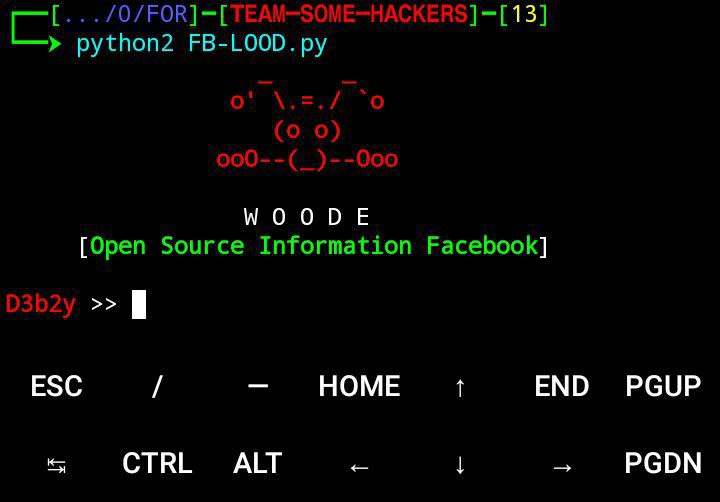

# FB-h
__Cybersecurity for information gathering.....!!__

[](https://t.me/NO_BRAK)


My channel Telegram

**FB-InfoGather is a cybersecurity tool designed for ethically gathering information about Facebook accounts. It helps extract public data such as username, account ID, profile pictures, friends, and groups using OSINT (Open-Source Intelligence) techniques. The tool is intended for cybersecurity researchers and penetration testers, with a strong emphasis on legal and ethical use only**


[اوامـر الـتشغيل](https://t.me/NO_BRAK/620)
```
git clone https://github.com/Woode-Ahmed/FB-h
```


```
cd FB-h
```


My channel Telegram

```
pip2 install -r requirements.txt
```


```
python2 FB-LOOD.py
```
